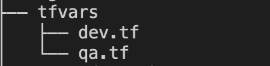

## Terraform security groups

This repository has multiple versions of ```Security group``` templates which will provision  on AWS provider.

1. Version 1.0 Hard coded Security group.

 This version of ```Security group``` is the hard coded configuration file, it's not a best practice to configure  your security group this way. But for the learning purposes it's good start as it's very simple and easy to understand. Not using variables makes your template ```not reusable```, and each time when you change a line of code, you need to go back to your code and look for it (sometimes it's lots of lines of code). Most of the time there's a big chance of unintetional changes. As we use ```IaaC``` such as ```Terraform```, one of the main purposes of it is to automate provisioning of your resources and avoid human errors. That's why try to make our code reusable, and when we write our code once we don't touch it, for that we use ```variables```.

2.  Version 1.1 Security group with variables.

<p>
This security group template is the most simplified version of how you can configure your security group resource block using variables in my example with variables.tf and dev.tfvars files.
</p>
<p>
Variables  makes your template reusable, where all the given variables can be changed depending your needs. All the changes has to be done in the listed files above, variables.tf where you you variables and dev.tfvars is where you give . Usually ```dev.tfvars``` is inside of the ```tfvars``` folder, it's best practice for separating environments. But when we do ```tfvars``` folder it would look like this:
</p>



3. Version 1.2 Security group with dynamic with locals.

This security group contains a "dynamic block"  and locals which contains all the 
attributes needed for creation of two inbound rules 22 and 80. "for_each"
meta-argument is itirating and getting the attributes for each security roup rule. 
Which makes our security group reusable, all the attributes can be changed in locals.tf

4. Version 1.2 Security group with dynamic with variables.

This security group contains a "dynamic block"  which creates 2 inbound rules 
22 and 80. In variables.tf we gave the definition for each rule and "for_each"
meta-argument is looping and getting correct data for each security roup rule. 
Which makes our security group reusable, where all the values in variables.tf
can be changed depending of the ports you need.